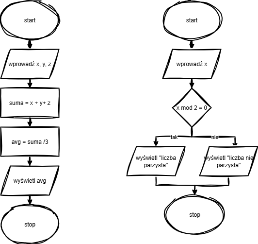
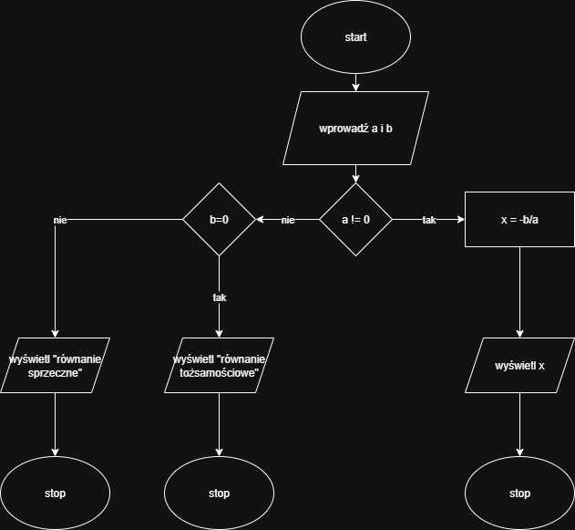

# Informatyka - Zbiór Zadań i Algorytmów

Repozytorium zawiera notatki, kody źródłowe oraz schematy blokowe z lekcji informatyki. Projekt jest skonfigurowany do działania w środowisku Python 3.11 (Replit).

## 📂 Zawartość Repozytorium

### 1. [Algorytmika i Etapy Rozwiązywania Problemów](./1_etapy_rozwiązywania_problemów_za_pomocą_komputera.py)
**Temat:** Teoretyczne i praktyczne podstawy tworzenia algorytmów.
* **Teoria:** Definicja algorytmu, specyfikacja (dane wejściowe/wyjściowe), 7 etapów pracy nad problemem.
* **Przykładowe algorytmy:**
    * Sprawdzanie znaku liczby (dodatnia/ujemna).
    * **Średnia arytmetyczna** (zawiera schemat blokowy: `zdj/zadanie2.png`).
    * Sprawdzanie parzystości (modulo).
    * Obliczanie podwyżki procentowej.
    * **Równanie liniowe $ax + b = 0$** (zawiera schemat blokowy: `zdj/zadanie5.png`).
    * Wartość bezwzględna.

### 2. [Podstawy Języka Python](./2_Podstawy_pythona.py)
**Temat:** Wprowadzenie do składni i typów danych.
* **Typy danych:** `int`, `float`, `str`, `bool`.
* **Operatory:** Arytmetyczne (`+`, `-`, `*`, `/`, `//`, `%`, `**`).
* **Wejście/Wyjście:** Funkcje `print()` oraz `input()`.

### 3. [Funkcje Matematyczne i Złożone Operatory Przypisania](./3_Funkcja_matematyczne_i_złożone_operatory_przypisania.py)
**Temat:** Zaawansowane operacje na liczbach i skrócony zapis przypisania.
* **Operatory przypisania:** `+=`, `-=`, `*=`, `/=`, `//=`, `%=`, `**=`.
* **Moduł math:** Wykorzystanie funkcji takich jak `sqrt()`, `sin()`, `cos()`, `floor()`, `ceil()` oraz stałej `pi`.
* **Zaokrąglanie:** Funkcja `round()` oraz formatowanie f-string.

### 4. [Pętle i Iteracje](./4_Instrukcje_iteracyjne.py)
**Temat:** Powtarzanie czynności i automatyzacja.
* **Pętla `for`:** Praca z zakresem `range()`, odliczanie w górę, w dół oraz ze zmiennym krokiem.
* **Pętla `while`:** Wykonywanie kodu dopóki warunek jest spełniony.
* **Instrukcje sterujące:** `continue` (pomijanie iteracji) i `break` (przerywanie pętli).

### 5. [Instrukcje Warunkowe](./5_Instrukcje_warunkowe_w_Pythonie.py)
**Temat:** Sterowanie przepływem programu na podstawie warunków.
* **Składnia:** `if`, `elif`, `else`.
* **Logika:** Operatory porównania (`>`, `<`, `==`, `!=`, `>=l`, `<=`) oraz logiczne (`and`, `or`, `not`).
* **Zadania:** Sprawdzanie parzystości, określanie znaku liczby, system oceniania na podstawie progów procentowych.

### 6. [Funkcje w Pythonie](./6_Funkcje_w_pythone.py)
**Temat:** Definiowanie własnych funkcji i reużywalność kodu.
* **Rodzaje funkcji:** Wyświetlające i zwracające wartość (`return`), z parametrami lub bez.
* **Zadania:** Funkcje wykonujące działania matematyczne (mnożenie, dzielenie z zabezpieczeniem przed zerem) oraz generowanie ciągów liczbowych.

### 7. [Algorytm Euklidesa i NWW](./7_Algorytm_Eukildesa.py)
**Temat:** Klasyczne algorytmy teorii liczb.
* **NWD (Największy Wspólny Dzielnik):** Implementacja metodą reszty z dzielenia (modulo) oraz metodą odejmowania.
* **NWW (Najmniejsza Wspólna Wielokrotność):** Obliczanie na podstawie NWD.
* **Zastosowanie:** Skracanie ułamków zwykłych.

### 8. [Zadanie: Dodawanie Ułamków](./zadanie.py)
**Temat:** Praktyczne zastosowanie NWD i NWW w działaniach na ułamkach.
* Program wczytuje dwa ułamki, sprowadza je do wspólnego mianownika (używając NWW), sumuje liczniki, a następnie skraca wynik i wyciąga całości.

---

## 🖼️ Schematy Blokowe
W folderze `zdj/` znajdują się wizualizacje algorytmów omawianych na lekcjach:

| Zadanie | Podgląd |
| :--- | :---: |
| **Średnia arytmetyczna i Parzystość** |  |
| **Równanie liniowe** |  |

---

## ⚙️ Informacje Techniczne
* **Język:** Python 3.11
* **Uruchamianie:** Plik `main.py` pełni funkcję interaktywnego menu, które pozwala wybrać i uruchomić konkretną lekcję bezpośrednio w konsoli.
* **Struktura projektu:**
    * `.replit`, `uv.lock`, `pyproject.toml` - pliki konfiguracyjne środowiska i menedżera pakietów.